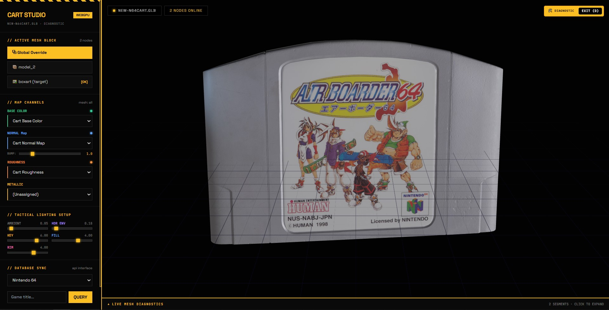

# Cartridge Studio 3D

A high-fidelity 3D Nintendo 64 cartridge customizer and visual UV diagnostic workbench.



### Features
*   **Interactive 3D Viewport:** Inverted orbit controls and scroll wheel zoom optimization.
*   **PBR Customizer:** Real-time Base Color, Normal, Roughness, and Metallic mapping.
*   **Lighting Array:** Five-channel real-time studio light controls.
*   **Diagnostics Panel:** Collapsible UI overlay showing active mesh stats and vertex details.

### Setup
1.  **Install dependencies:**
    ```bash
    bun install
    ```
2.  **Configure environment:**
    Copy `.env.example` to `.env.local` and add your local API keys.
3.  **Run development server:**
    ```bash
    bun run dev
    ```
